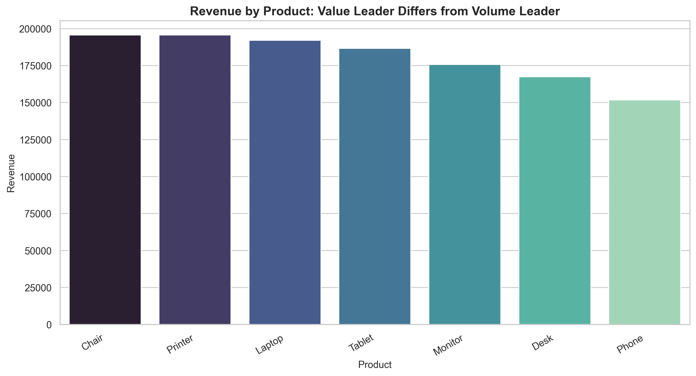
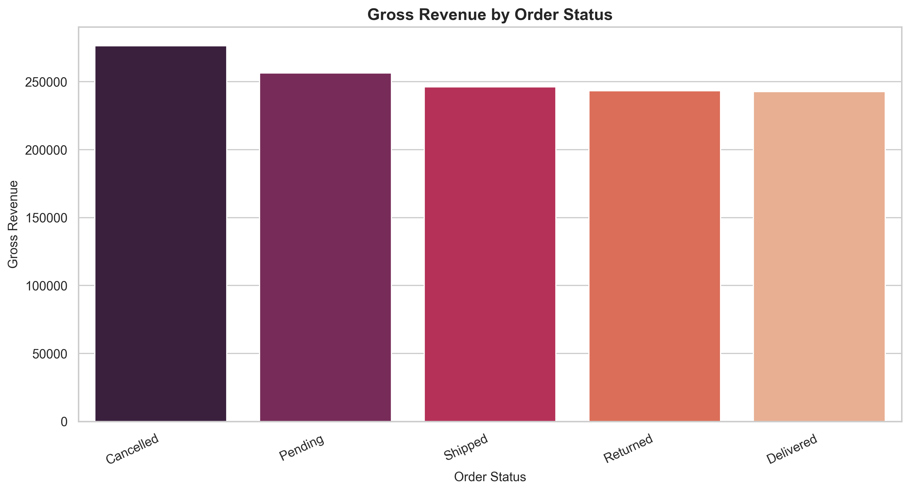
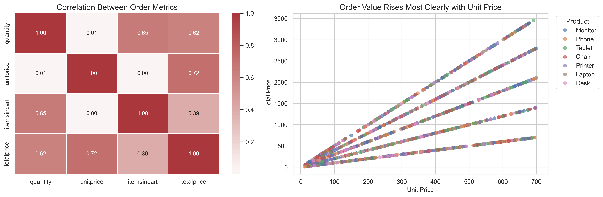
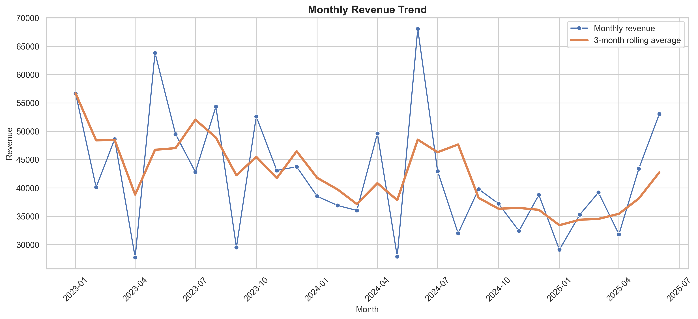

# E-Commerce Orders Exploratory Analysis

This project explores a small e-commerce orders dataset with `1,200` transactions from `2023-01-01` to `2025-06-30`.

The analysis looks at order value, product performance, order status, referral source, coupon usage, payment method, and monthly revenue patterns. I kept the final notebook focused on the charts and tables that actually support the main findings; earlier supporting charts are still available in the appendix folder.

## Business Questions

- Which products lead by revenue, and are they the same products that lead by order volume?
- How much does order status affect the way gross revenue should be interpreted?
- Which referral sources, coupon groups, and payment methods stand out descriptively?
- Is order value driven more by quantity, unit price, or cart size?
- Are there high-value orders or monthly spikes worth investigating further?

## Dataset

Each row is one order transaction. Main fields include:

- `OrderID`, `CustomerID`, `TrackingNumber`
- `Date`
- `Product`
- `Quantity`, `UnitPrice`, `ItemsInCart`, `TotalPrice`
- `PaymentMethod`, `OrderStatus`, `CouponCode`, `ReferralSource`

The dataset is clean enough for EDA after treating blank coupon values as `No Coupon`. It also appears unusually balanced across categories, so I treat the findings as descriptive rather than definitive business evidence.

## Tools

- Python
- pandas
- numpy
- matplotlib
- seaborn
- Jupyter Notebook

## What I Did

1. Loaded and inspected the Excel dataset.
2. Standardized column names and parsed dates.
3. Added month, quarter, year, and day-of-week fields.
4. Treated missing coupon values as `No Coupon`.
5. Checked duplicates, missing values, ID uniqueness, date coverage, and revenue consistency.
6. Validated that `TotalPrice` matches `Quantity x UnitPrice`.
7. Reviewed descriptive statistics, skewness, and IQR outliers.
8. Analyzed product, status, referral, coupon, payment, and monthly performance.
9. Reduced chart output into a smaller selected set plus an appendix.
10. Documented limitations around missing cost data, possible randomness, and non-causal interpretation.

## Main Findings

- `Chair` has the highest revenue, while `Printer` has the highest order count. Volume and value are not identical.
- `TotalPrice` is moderately right-skewed, so the average order value needs to be read alongside the median and high-value order segment.
- Eight high-value orders were flagged by the IQR method. They look valid based on the revenue formula check, so I would not remove them automatically.
- `UnitPrice` has a stronger relationship with `TotalPrice` than `Quantity`. This is partly mechanical, but it still shows that product mix matters.
- `Cancelled` orders carry the largest gross revenue total. This is worth follow-up, although the dataset does not include cancellation reasons.
- `Instagram` has the highest referral-source revenue, but campaign spend is missing, so channel profitability cannot be concluded.
- `FREESHIP` has the highest average order value among coupon groups, but discount or shipping subsidy cost is unavailable.

## Selected Visuals

### Revenue by Product



### Gross Revenue by Order Status



### Revenue Driver Relationships



### Monthly Revenue Trend



## Project Structure

```text
Project-2-EDA/
|-- README.md
|-- requirements.txt
|-- data/
|   |-- Dataset for Data Analytics.xlsx
|-- notebook/
|   |-- eda_analysis.ipynb
|-- reports/
|   |-- cleaned_ecommerce_orders.csv
|   |-- eda_numeric_summary.csv
|   |-- project2_eda_report.html
|-- visuals/
|   |-- selected/
|   |   |-- channel_and_coupon_performance.png
|   |   |-- gross_revenue_by_order_status.png
|   |   |-- monthly_revenue_trend.png
|   |   |-- order_value_distribution_and_outliers.png
|   |   |-- product_status_revenue_heatmap.png
|   |   |-- revenue_by_product.png
|   |   |-- revenue_driver_relationships.png
|   |-- appendix/
|       |-- supporting exploratory charts
```

## Files

- Final HTML report: [`reports/project2_eda_report.html`](reports/project2_eda_report.html)
- Notebook: [`notebook/eda_analysis.ipynb`](notebook/eda_analysis.ipynb)
- Cleaned data: [`reports/cleaned_ecommerce_orders.csv`](reports/cleaned_ecommerce_orders.csv)
- Numeric summary: [`reports/eda_numeric_summary.csv`](reports/eda_numeric_summary.csv)
- Main visuals: [`visuals/selected`](visuals/selected)
- Supporting visuals: [`visuals/appendix`](visuals/appendix)

## How to View or Run

For a quick review, open the HTML report:

[`reports/project2_eda_report.html`](reports/project2_eda_report.html)

To run the notebook locally:

```bash
pip install -r requirements.txt
jupyter notebook notebook/eda_analysis.ipynb
```

## Limitations

- The data may be synthetic or randomized; category distributions are very even.
- Revenue is not profit. Product cost, shipping cost, coupon cost, refund amount, and margin are missing.
- Referral-source revenue does not prove marketing effectiveness because campaign spend and conversion rates are not available.
- Coupon performance cannot be evaluated fully without discount cost or margin impact.
- Order status exists, but cancellation reasons, return reasons, delivery times, and stock availability are not included.
- Correlations are descriptive only. They should not be interpreted as causal findings.

## Next Improvements

The most useful next step would be better source data, not more charts. I would add:

- product cost and margin
- discount and shipping subsidy amounts
- cancellation and return reasons
- delivery timestamps
- campaign spend or traffic data
- more complete customer history for retention analysis

## Technical Summary

This project demonstrates a complete EDA workflow: data loading, validation, feature engineering, statistical review, visual exploration, and written interpretation. The final notebook is deliberately selective so the main analysis is easier to read and the supporting charts remain available without crowding the project.
