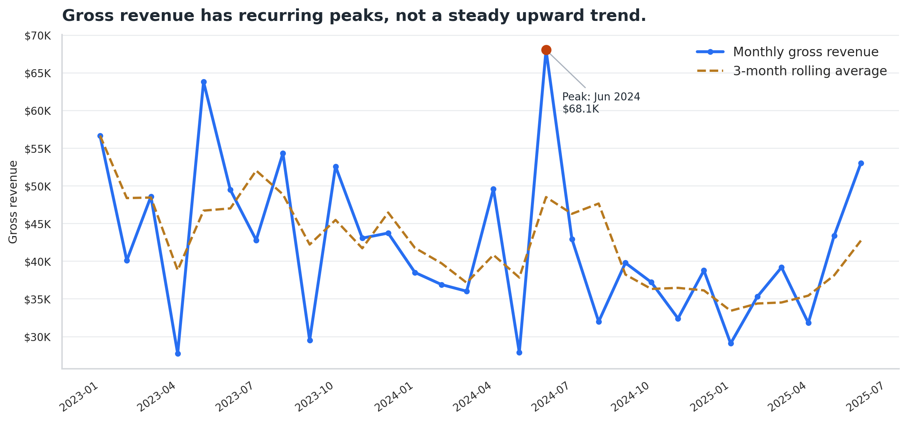
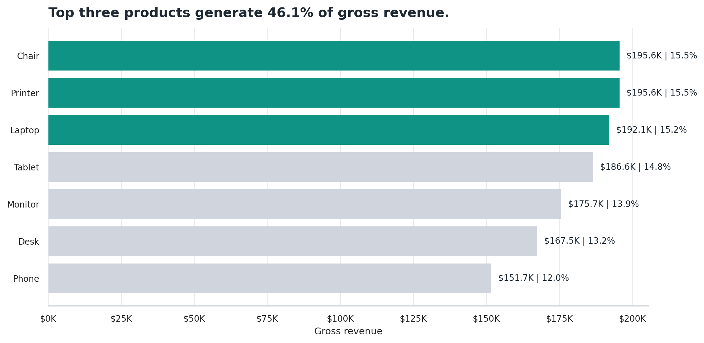
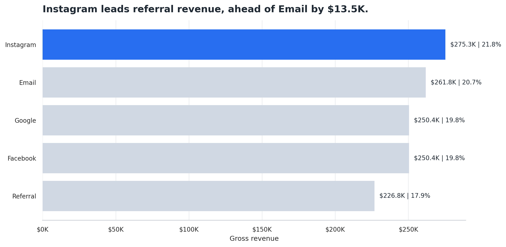
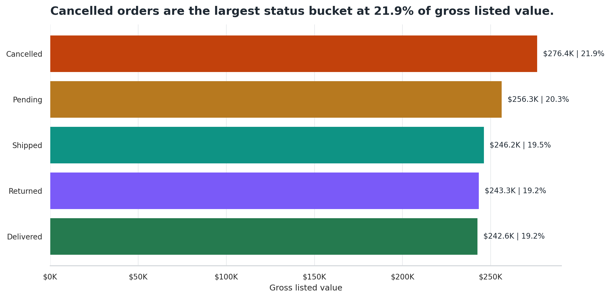

# Project 4: Data Visualization and Executive Storytelling

## Overview

This project converts an e-commerce orders dataset into a business-facing executive narrative. The final deliverable goes beyond descriptive visualization by focusing on revenue realization, operational bottlenecks, order-status risk, and management decision-making.

The analysis uses 1,200 order records from January 1, 2023 through June 30, 2025. Revenue is measured using gross order value from the `TotalPrice` field.

## Objectives

- Build an explanatory visualization workflow from the provided Excel dataset.
- Translate analytical findings into a concise executive presentation.
- Identify where gross order value may not translate into realized revenue.
- Communicate operational risks and management actions clearly.
- Document limitations without inventing unsupported profitability or ROI claims.

## Dataset

The dataset contains one row per order transaction. Key fields include:

- `OrderID`, `Date`, `CustomerID`
- `Product`, `Quantity`, `UnitPrice`, `TotalPrice`
- `OrderStatus`, `PaymentMethod`, `ReferralSource`, `CouponCode`
- `ItemsInCart`, `TrackingNumber`, `ShippingAddress`

The notebook validates that `TotalPrice` matches `Quantity x UnitPrice`. Missing business fields are treated as limitations rather than estimated or invented.

## Executive Summary

The final presentation reframes the project around revenue leakage risk. The dataset shows approximately $1.26M in gross order value, but gross revenue alone is not enough for management decision-making because a substantial share of value sits in unresolved or non-final order states.

Pending, Returned, and Cancelled orders represent 61.4% of gross listed value. This makes order-status resolution the central business issue: before leadership can evaluate growth, channel performance, or product investment, the organization needs clearer rules for realized revenue and better visibility into cancellation, return, and fulfillment outcomes.

## Executive Presentation

The primary executive deliverable is:

[`presentation/Plugging_Revenue_Leakage.pptx`](presentation/Plugging_Revenue_Leakage.pptx)

This presentation converts the analytical findings into a consulting-style management narrative. It focuses on the gap between gross order value and realized revenue, highlights operational bottlenecks, and turns the analysis into practical recommendations for leadership.

## Key Business Findings

- Gross order value is approximately `$1.26M` across 1,200 orders.
- `61.4%` of gross listed value sits in unresolved or non-final states: `Pending`, `Returned`, and `Cancelled`.
- `Cancelled` orders represent the largest single status bucket by gross listed value.
- Revenue concentration exists across a small number of products, but product performance should not be interpreted as profitability without cost and margin data.
- Gross revenue alone is insufficient for decision-making because the dataset does not include net revenue, margin, channel spend, cancellation reasons, or return reasons.

## Management Recommendations

- Investigate cancellation drivers by product, referral source, and order characteristics.
- Define revenue realization rules so leadership can distinguish gross listed value from realized revenue.
- Improve fulfillment tracking across pending, shipped, delivered, returned, and cancelled statuses.
- Integrate channel spend and margin data before making marketing or product investment decisions.
- Improve operational visibility by collecting cancellation reasons, return reasons, fulfillment milestone dates, and final revenue outcomes.

## Visualization Philosophy

This project follows an explanatory visualization approach:

- Use fewer charts with clearer messages.
- Avoid chartjunk, 3D charts, decorative graphics, and rainbow palettes.
- Use direct labels where practical.
- Write action-oriented chart titles that state the finding.
- Keep recommendations tied to evidence available in the dataset.

## Selected Visuals

### Monthly Revenue Trend



### Product Revenue Ranking



### Referral Revenue Contribution



### Order Status Revenue Impact



## Project Structure

```text
Project-4-Data-Visualization/
|-- data/
|   |-- Dataset for Data Analytics.xlsx
|-- notebook/
|   |-- visualization_storytelling.ipynb
|-- visuals/
|   |-- 01_monthly_revenue_trend.png
|   |-- 02_product_revenue_ranking.png
|   |-- 03_referral_revenue_contribution.png
|   |-- 04_order_status_revenue_impact.png
|-- presentation/
|   |-- Plugging_Revenue_Leakage.pptx
|-- reports/
|   |-- project4_visualization_report.html
|-- README.md
|-- requirements.txt
```

## Tools Used

- Python
- pandas
- NumPy
- Matplotlib
- Seaborn
- Jupyter Notebook
- PowerPoint

## Output Files

- Executive presentation: [`presentation/Plugging_Revenue_Leakage.pptx`](presentation/Plugging_Revenue_Leakage.pptx)
- Notebook: [`notebook/visualization_storytelling.ipynb`](notebook/visualization_storytelling.ipynb)
- HTML report: [`reports/project4_visualization_report.html`](reports/project4_visualization_report.html)
- Final visuals: [`visuals/`](visuals/)

## Reproducibility

From the project root, install dependencies:

```bash
pip install -r requirements.txt
```

Run the notebook from the `notebook/` directory so the relative paths resolve correctly. The notebook loads the Excel dataset, prepares the analysis tables, and saves the supporting visuals used in the project.

## Limitations

- The dataset contains gross order value only, not net revenue or profit.
- Cost, margin, discount expense, and advertising spend are unavailable.
- Cancellation and return reasons are unavailable.
- Referral source revenue cannot be interpreted as channel ROI without spend or traffic data.
- The dataset appears balanced across categories, so findings should be treated as descriptive rather than causal.
- There is no literal `Completed` order status field; the analysis keeps the original status values visible.
